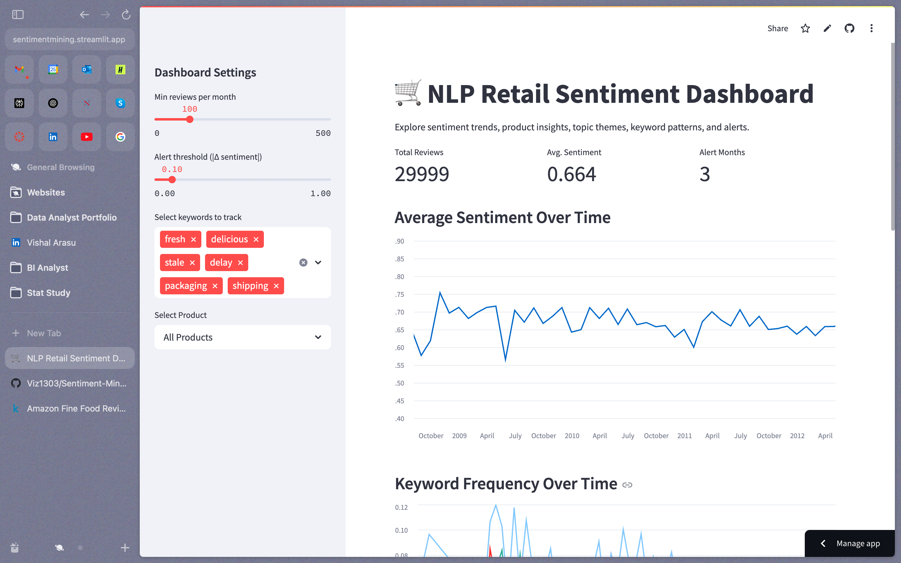
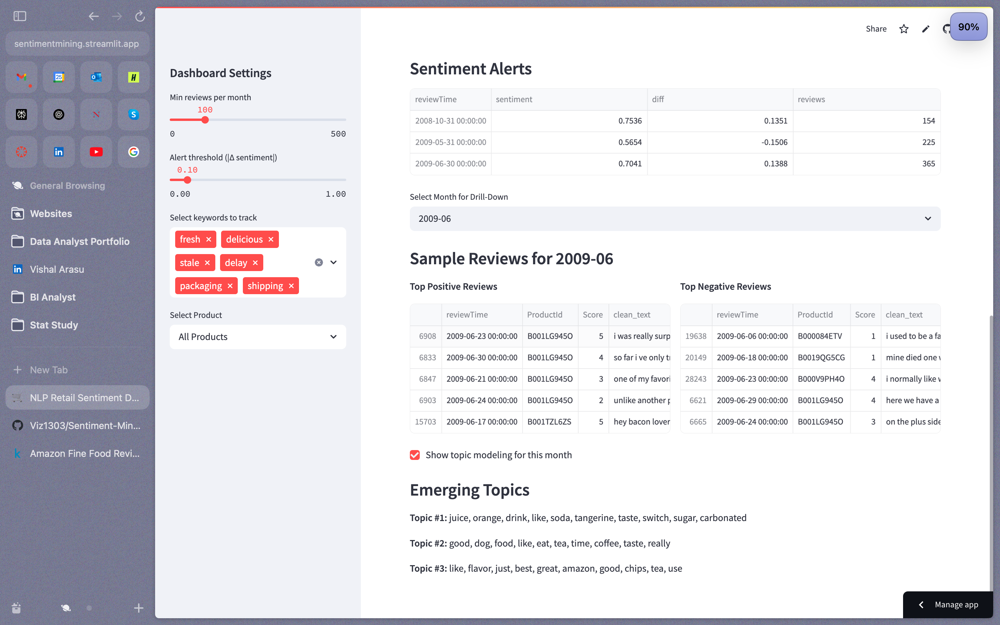

# NLP Amazon Fine Food Reviews Sentiment Dashboard

An interactive Streamlit app that performs sentiment mining and trend analysis on Amazon Fine Food Reviews.  
Features:
- **Overall & product-level sentiment trends**  
- **Keyword frequency over time**  
- **Automatic alerts** for significant sentiment shifts  
- **Sample review drill-down** with positive/negative examples  
- **On-demand topic modeling** for selected months  

## 🔗 Dataset

Data from the Kaggle “Amazon Fine Food Reviews” dataset:  
https://www.kaggle.com/datasets/snap/amazon-fine-food-reviews

## 🛠️ Tech Stack

- **Python 3.9**  
- **Streamlit** for the dashboard  
- **Pandas** for data manipulation  
- **NLTK VADER** for sentiment scoring  
- **scikit-learn** for LDA topic modeling  
- **Matplotlib** for custom plotting  

## 📸 Screenshots

### Overall Dashboard

### Alerts & Topic Modeling

## 🔍 Insights

- **Data Preparation & Cleaning**  
  – Loaded ~568,000 Amazon Fine Food reviews, converted Unix timestamps to datetimes, filled 27 missing summaries, dropped 0 missing texts/ratings, and removed 1,309 exact duplicate reviews.  
  – Created a `clean_text` column (lowercasing, HTML/punctuation removal) for NLP.

- **Sentiment Analysis & Validation**  
  – Applied NLTK’s VADER to compute a compound sentiment score (–1 to +1) for every review.  
  – Verified strong positive correlation with star ratings (mean sentiment: 1⭐≈0.04 → 5⭐≈0.77), confirming VADER’s reliability for this domain.

- **Trend Analysis & Noise Filtering**  
  – Aggregated average sentiment by month and plotted a continuous timeline.  
  – Early years (1999–2004) exhibited large swings due to very low review volumes (3–4 reviews/month).  
  – Filtered to include only months with ≥100 reviews (88 months retained) to ensure statistically robust trends.

- **Interactive Product-Level Exploration**  
  – Precomputed the top 50 products by review count and added a sidebar selector.  
  – Users can drill into sentiment trends, keyword frequencies, and review samples for any individual product.

- **Keyword Frequency Tracking**  
  – Tracked monthly occurrence rates of customizable keywords (e.g., “fresh,” “delicious,” “delay,” “packaging”) to surface shifting customer concerns.  
  – Aligned keyword curves with sentiment trends for richer context.

- **Automated Alerts**  
  – Flagged any month where |Δ sentiment| ≥ chosen threshold (default 0.10).  
  – Displayed alert table with month, avg. sentiment, Δ sentiment, and review volume for quick anomaly detection.

- **Deep-Dive Sample Reviews**  
  – Enabled drill-down to view the top 5 most positive and top 5 most negative reviews for any alerted month.  
  – Provided direct “voice of the customer” examples to explain sentiment swings.

- **On-Demand Topic Modeling**  
  – Integrated LDA to surface the top 3 topics (10 keywords each) within the reviews of any selected month.  
  – Helps automatically pinpoint themes driving sentiment spikes or dips.

---

## 📈 Key Findings

| Finding | Description |
|:---|:---|
| **Oct 2005 Spike (+0.15)** | Customers raved about **premium chocolates** (e.g., brandy-filled truffles), praising **flavor**, **freshness**, and **gift-worthy packaging**. |
| **Feb 2006 Dip (–0.15)** | Reviews plummeted over **shipping delays**, **product defects** (e.g., split coffee pods, off-smelling noodles), and unmet **expectations**. |
| **Stable Period (2006–2014)** | After filtering low-volume months, sentiment stabilized around **0.65**, with smaller seasonal swings. |
| **Keyword Insights** | Terms like **“fresh”** and **“delicious”** tracked closely with positive spikes, while **“delay”** and **“stale”** aligned with negative dips. |
| **Actionable Alerts** | The dashboard’s alert system reliably surfaces months where customer sentiment shifts by **≥10%**, enabling timely root-cause analysis. |

