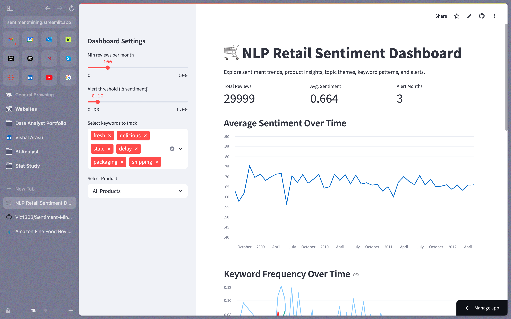
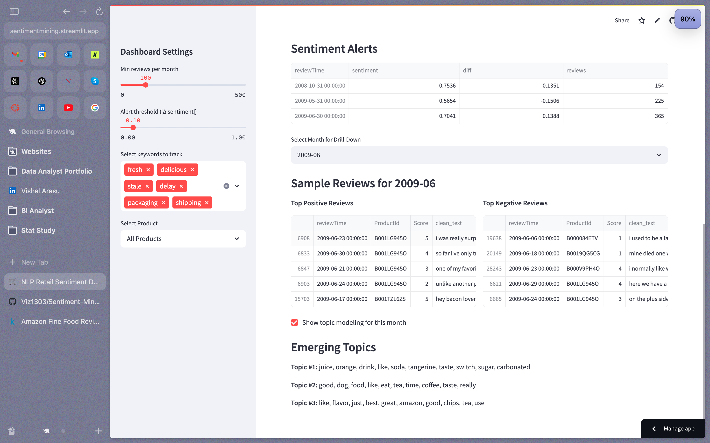

# The Voice of the Customer: Sentiment & Trend Analysis on Amazon Food Reviews 

## Overview  
This project uses **Natural Language Processing (NLP)** on the Amazon Fine Food Reviews dataset (~568,000 reviews) to create an **interactive Streamlit dashboard** that transforms raw customer feedback into actionable business insights.  

Originally motivated by a desire to work with **NLTK’s VADER package**, the project evolved into a **customer sentiment intelligence tool** with real-world business applications:  

- **Revenue Protection** – Detect negative sentiment linked to shipping delays, stale products, or poor packaging early, reducing churn.  
- **Product Development** – Track keyword trends (“fresh,” “stale,” “delay”) to identify product quality issues and improve offerings.  
- **Marketing Insights** – Spot positive spikes (e.g., “delicious,” “gift-worthy”) to drive targeted campaigns and seasonal promotions.  
- **Customer Retention** – Automated alerts flag sentiment dips ≥10%, enabling proactive service recovery before negative reviews snowball.  
- **Strategic Decisions** – Topic modeling reveals hidden themes behind sentiment swings, guiding supply chain, merchandising, and R&D strategies.  

---

## Dataset  
Amazon Fine Food Reviews (Kaggle):  
https://www.kaggle.com/datasets/snap/amazon-fine-food-reviews  

---

## Tech Stack  
- **Python 3.9**  
- **Streamlit** for the interactive dashboard  
- **Pandas** for data manipulation  
- **NLTK VADER** for sentiment scoring  
- **scikit-learn** for LDA topic modeling  
- **Matplotlib** for plotting  

---

## Dashboard Screenshots  

### Overall Dashboard  
  

### Alerts & Topic Modeling  
  

---

## Dashboard Features  

- **Overall & Product-Level Sentiment Trends** → Monitor customer satisfaction across time and products.  
- **Keyword Frequency Tracking** → Follow shifts in product-related terms (e.g., freshness, packaging).  
- **Automated Alerts** → Get notified when monthly sentiment changes exceed a set threshold.  
- **Sample Reviews Drill-Down** → Read the top 5 positive and negative reviews for any alert month.  
- **On-Demand Topic Modeling** → Use LDA to surface recurring themes behind sentiment spikes or dips.  

---

## Insights  

### 1. Sentiment Stability with Occasional Dips  
- Average sentiment hovers around **0.66** (positive), showing general satisfaction.  
- However, dips of **≥0.10** were observed in specific months tied to **shipping delays** and **defective products**.  

### 2. Keyword Trends Reflect Quality Issues  
- Positive terms like **“fresh”** and **“delicious”** align with spikes in sentiment.  
- Negative terms like **“delay”**, **“stale”**, and **“packaging”** consistently appear in downturns, signaling recurring operational problems.  

### 3. Actionable Alerts Enable Proactive Action  
- Example: A **–0.15 dip in May 2009** linked to shipping problems and defective coffee pods.  
- Management could have intervened with improved logistics or supplier changes to prevent customer loss.  

### 4. Positive Spikes Suggest Marketing Opportunities  
- Example: A **+0.15 spike in Oct 2005** tied to premium chocolates described as “gift-worthy.”  
- Insights like these could be leveraged for **holiday marketing campaigns**.  

### 5. Business Value of NLP  
- The dashboard provides **real-time voice-of-the-customer monitoring**, enabling companies to:  
  - Improve **supply chain reliability** (fix recurring “delay” issues).  
  - Optimize **product quality control** (address “stale” complaints).  
  - Enhance **customer experience** (proactive outreach in alert months).  
  - Drive **incremental revenue** by doubling down on products or features customers praise.  

---

## Lessons Learned  

1. **Customer Reviews = Revenue Signal**  
   Analyzing unstructured reviews surfaces issues that directly impact churn and repeat purchase rates.  

2. **Automation Adds Value**  
   The alert system allows teams to **act quickly**, turning reviews into a live feedback loop instead of static reports.  

3. **NLP Bridges Tech and Business**  
   Even a relatively simple model like **VADER + LDA** can drive impactful insights when tied to the right metrics (sentiment shifts, keyword frequency, themes).  

4. **Scalable Use Cases**  
   The same approach can extend to **e-commerce, hospitality, or SaaS reviews** — anywhere customer sentiment matters.  

---

**In essence**: What began as an NLP practice project became a **business intelligence tool** showing how companies can mine massive review datasets to protect revenue, enhance customer experience, and inform smarter product and marketing decisions.  

  
